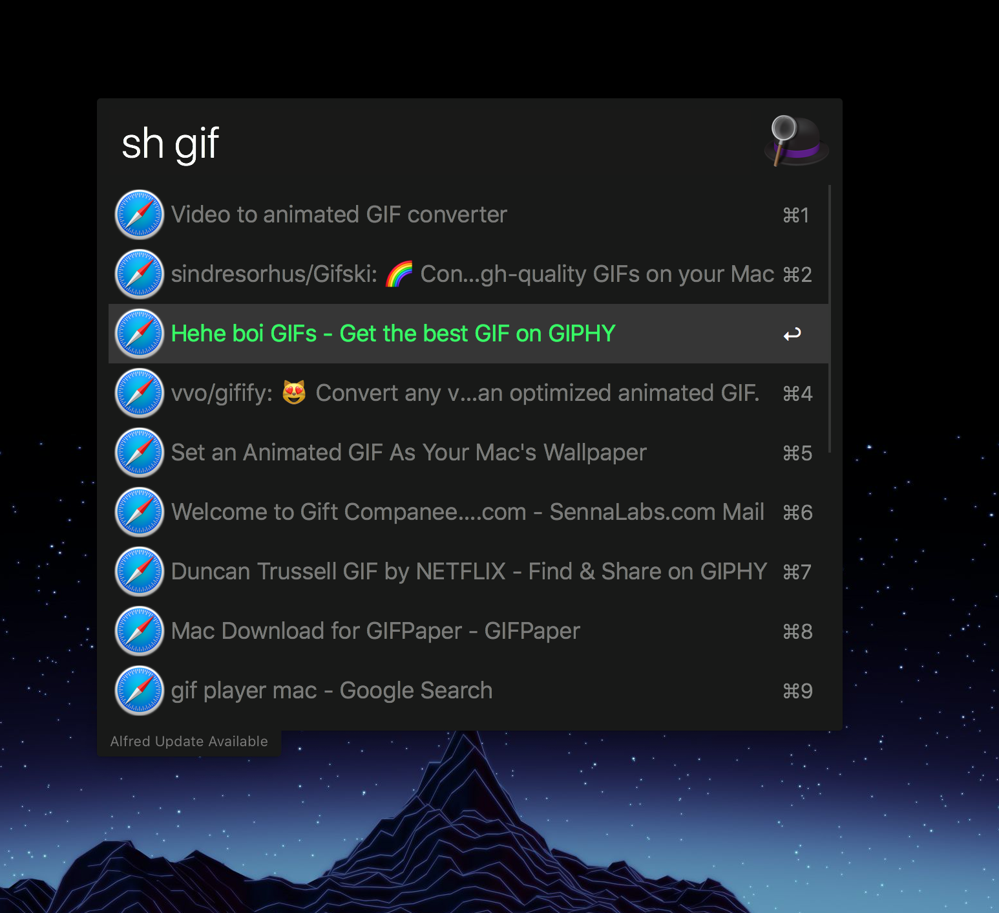

  
   
   
  

    <b>sh - Super fast Alfred 3+ workflow to search through Safari history 🕵️‍♀️</b>
  

  

      <i>Helps you to search through Safari history faster, saving precious time</i>
  

  

  

  

    Built with ❤︎ by
      <a href="https://github.com/gigantik">gigantik</a> and
    
  

    

Download & installation
-----------------------

Grab the workflow from GitHub repository. Download the sh - Safari History Fuzzy Search.alfredworkflow file and double-click it to install.

Usage
-----

- `sh [<query>]` — Search and open recent history
